# KidsBlock Development Environment Configuration

 

**Please refer to the link to install and use the KidsBlock software：** 
[https://kidsblocksite.readthedocs.io/en/latest/](https://kidsblocksite.readthedocs.io/en/latest/)

 
 
 

**Note:** The control board used in this kit is the kidsIOT board. For importing the kidsIOT board, libraries and sample codes, please refer to the following content.

 
 

1.Click to enter the main page, and select the control board needed. In this project, we select the kidsIOT mainboard and click **Connect**, then it is connected. Click Go to Editor to return the code editor. Icon will change into  and  will change into . This means the kidsIOT mainboard and ports（COM)are connected.

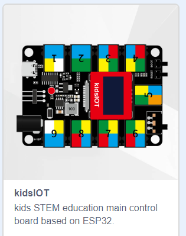

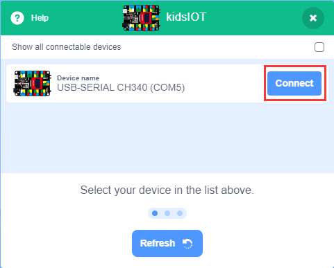

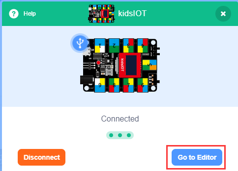

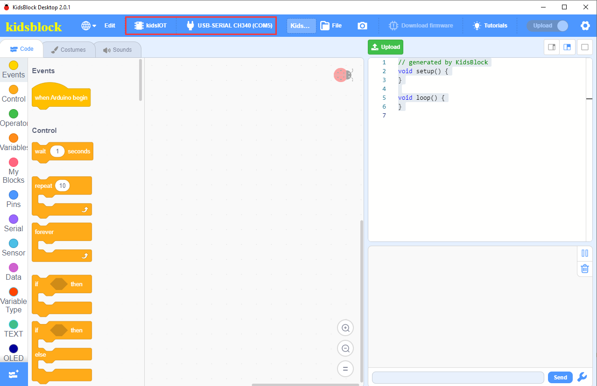

2.If the kidsIOT mainboard is connected , but icon doesn’t change into . You need to click to connect the COM port. Click. Then you will find a page pop up, showing Connected.

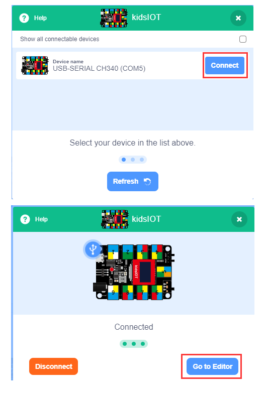

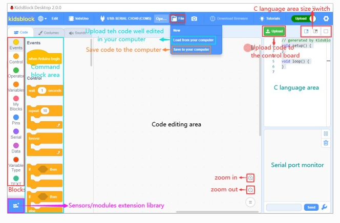

To disconnect the port, just click and Disconnect.

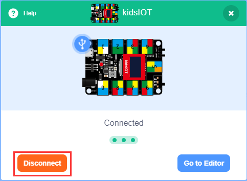

Note：If you want to update libraries of KidsBlock, click then Clear cache and restart.

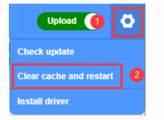

4.stands for extension libraries of sensors and modules. Click to enter the page of extension libraries, click a sensor or module to add. For example, if click the **esp32 passive buzzer** module,**Not loaded** will change into **Loaded**. Then the passive buzzer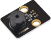 is added.                           
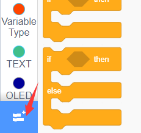

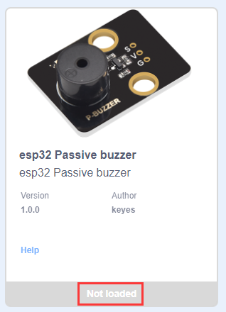

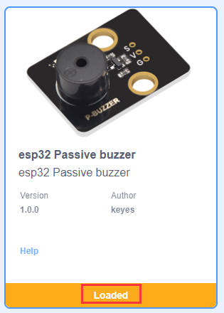

Click to return to the code editor. Then you can view the passive buzzer in the blocks area.

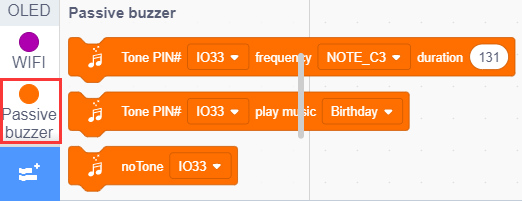

If you want to delete the **passive buzzer**, click to select the “**esp32 Passive buzzer**”. Then **Loaded** will change into **Not loaded**. Then the passive buzzer is deleted.

The way of deleting other sensors or modules is as same as the passive buzzer.

5.How to open SB3 type files：

The first method： Double-click SB3 type files to open them. For instance, open, then we need to double-click it.

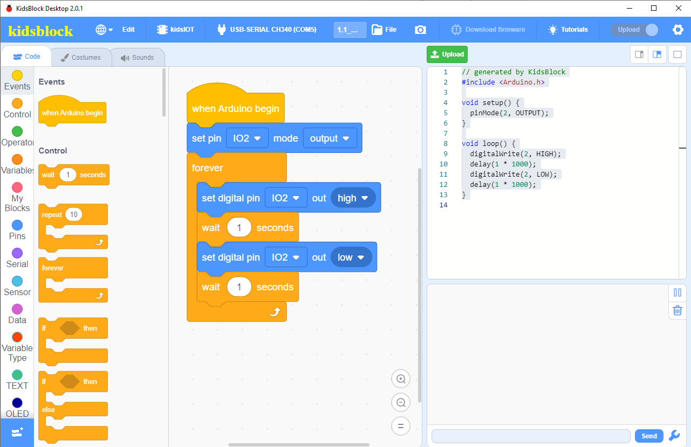

The second method: Open Kidsblock，click **file** and **Load from your computer**，then select the SB3 type file on the computer.（for example)

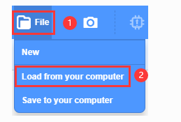

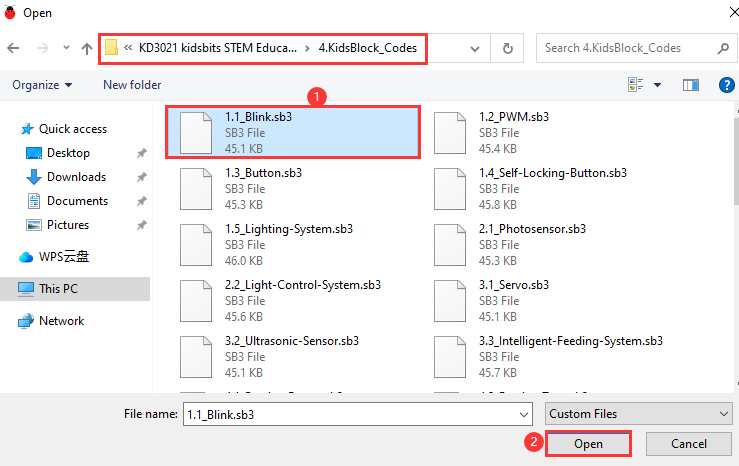

