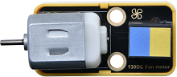
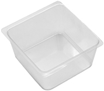

# Read Me First

## 1. Downloading the code:

* [KidsBlock_Codes](KidsBlock_Codes.zip)

## 2. Introduction:

Based on the ESP32 IoT, the smart farm integrates multiple sensors such as a photoresistor, a soil moisture sensor, a water level sensor as well as a WiFi wireless communication module in a way that achieves automation, wireless operation and intelligent management. What’s more, it is capable of realizing intelligent functions such as sensing, early warning, decision-making and analysis.

Therefore, the product contributes to helping you master how to use sensors to build an IoT system, and how to realize smart farm management via KidsBlock graphical programming.

By the way, detailed projects, sample code and LEGO building are provided in it, thus enhancing our hands-on ability, creativity, scientific and technological innovation awareness as well as problem-solving ability.

## 3. Kit List

| # | Components | QTY | Picture |
| :--: | :--: | :--: |:--: |
| 1 | kidsIOT Mainboard | 1 | |
| 2 | Button Sensor | 1 |  |
| 3 | Steam Sensor | 1|  |
| 4 | PIR Motion Sensor |1 | |
| 5 | Photoresistor | 1 | |
| 6 | Ultrasonic Adapter Board | 1 | |
| 7 | Ultrasonic Sensor | 1 | |
| 8 | White LED Module | 1 | |
| 9 | Relay Module | 1 | |
| 10 | Passive Buzzer | 1 | |
| 11 | Motor | 1 | |
| 12 | Temperature and Humidity Sensor | 1 | |
| 13 | GPIO Shield | 1 ||
| 14 | Servo | 1 | |
| 15 | Water Level Sensor |1| |
| 16 | Soil Moisture Sensor |1| |
| 17 | Water Pump | 1 ||
| 18 | Water Pipe | 1 ||
| 19 | USB Cable | 1 | |
| 20 | Battery Holder | 1 | |
| 21 | 20cm Wire | 3 | |
| 22 | 30cm Wire | 8 | |
| 23 | F-F DuPont Wire | 1 ||
| 24 | M-F DuPont Wire | 1 ||
| 25 | Slotted Screwdriver | 1 ||
| 26 | Sink | 2 ||
| 27 | Fan | 1 ||
| 28 | AA Battery（Not provide） | 6 ||
| 29 | Lighting System LEGO Pieces | 1 ||
| 30 | Light Controlled System LEGO Pieces | 1 ||
| 31 | Anti-theft Alarm System LEGO Pieces | 1 ||
| 32 | Automatic Feeding System LEGO Pieces | 1 ||
| 33 | Rainwater Control System LEGO Pieces | 1 ||
| 34 | Temperature and Humidity System LEGO Pieces | 1 ||
| 35 | Soil Moisture/Water Level/Automatic Irrigation System LEGO Pieces | 1 ||
| 36 | Lego Board | 2 ||

